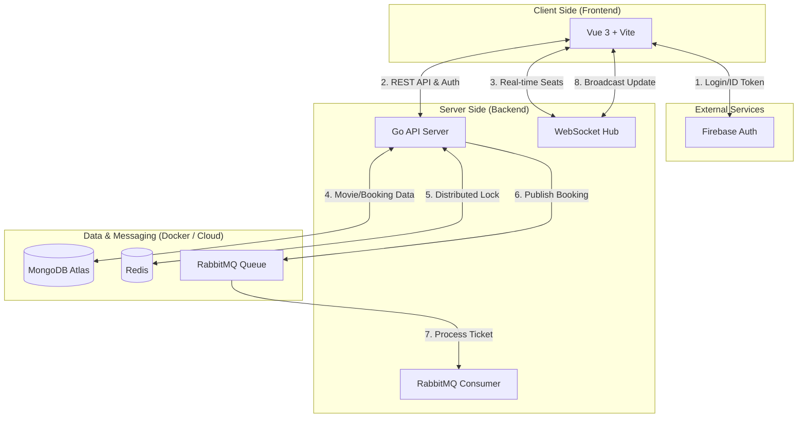

# 🎬 CinemaHub - Real-time Cinema Ticket Booking System

CinemaHub is a full-stack booking platform. It features a robust concurrency model to prevent double-bookings, real-time seat map synchronization, and asynchronous ticket processing.

---

## 🌟 Key Features

### 🔐 Multi-Provider Authentication
- Secure login using **Firebase Authentication**.
- Supports **Google Sign-In** and **Email/Password**.
- Role-based access control (User / Admin) using Custom Firebase Claims.

### 💺 Concurrency & Real-time
- **Distributed Locking**: Uses **Redis `SETNX`** to lock seats for 5 minutes during selection, ensuring no two users can pick the same seat.
- **WebSocket Synchronization**: Real-time seat status updates (Available / Locked / Booked) broadcasted to all users instantly.
- **Lazy Cleanup**: Automatic release of expired seat locks both via background logic and on-demand synchronization.

### 🐰 Asynchronous Processing
- **RabbitMQ Integration**: Decouples booking confirmation from ticket generation.
- **Background Worker**: Simulates mock messages (ticket PDF generation and email notifications).

### 🛡️ Administrative Control
- Secure **Admin Dashboard** with advanced filters (Movie Title, User ID).
- Ability to monitor all system bookings and cancel reservations.

---

## 🛠 Tech Stack

| Category | Technology |
| :--- | :--- |
| **Backend** | Go (Gin) |
| **Frontend** | Vue 3 |
| **Database** | MongoDB |
| **Cache/Locking** | Redis |
| **Message Broker** | RabbitMQ |
| **Auth** | Firebase |

---

## 📦 Getting Started

### 1. Environment Setup
Create a `.env` file in the **root directory**, use `.env.example` as a template.

### 2. Deploy with Docker
Run the following command to build and start the application:
```bash
docker compose up --build
```
- **Frontend**: [http://localhost:5173](http://localhost:5173)
- **Backend API**: [http://localhost:8080](http://localhost:8080)
- **RabbitMQ UI**: [http://localhost:15672](http://localhost:15672) (`guest/guest`)

---

## 🚀 Development Utilities

### Seed Database
Populate your MongoDB Atlas with movies and showtimes:
```bash
cd Backend
go run cmd/seed/main.go
```

### Manage Admin Roles
Promote or demote users to/from the Admin role:
```bash
# Promote
go run cmd/admin/main.go promote <FIREBASE_USER_ID>

# Demote
go run cmd/admin/main.go demote <FIREBASE_USER_ID>
```

---

## 🏗 Architecture Overview

1.  **Frontend** sends a lock request for a seat.
2.  **Backend** checks **Redis**. If available, sets a key with a 5-minute expiry.
3.  **Backend** updates **MongoDB** status to `LOCKED`.
4.  **WebSocket Hub** broadcasts the change to all other clients.
5.  On **Confirm**, the lock is released, and a message is sent to **RabbitMQ**.
6.  **Background Worker** consumes the message to process the final booking.



