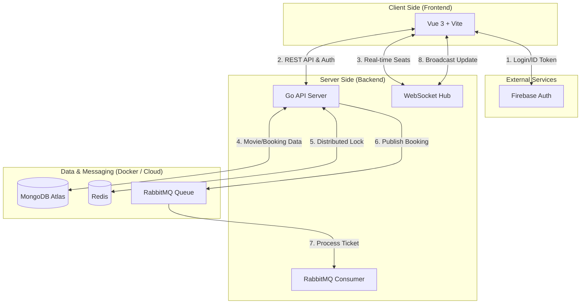

# 🎬 CinemaHub - Cinema Ticket Booking System

CinemaHub is a full-stack, real-time cinema ticket booking application. This project demonstrates high-concurrency seat management, asynchronous processing, and secure administrative controls.

## 🚀 Key Features

*   **Secure Authentication**: Multi-provider login (Google + Email/Password) via Firebase.
*   **Real-time Seat Selection**: WebSocket-enabled interface for instant updates when seats are locked/unlocked.
*   **Concurrency Handling**: Redis Distributed Locking (`SETNX`) to prevent double-booking.
*   **Asynchronous Processing**: RabbitMQ for background ticket generation and email simulation.
*   **Admin Dashboard**: Dedicated management interface for tracking bookings and canceling reservations.
*   **Full Dockerization**: One-command deployment for the entire stack.

## 🛠 Tech Stack

| Category | Technology |
| :--- | :--- |
| **Backend** | Go (Gin) |
| **Frontend** | Vue 3 |
| **Auth** | Firebase |
| **Database** | MongoDB |
| **Cache/Locking** | Redis |
| **Message Broker** | RabbitMQ |

## 🌐 System Architecture Diagram




## 🔄 Booking Flow

1.  **Selection**: User selects a movie and showtime (Publicly viewable).
2.  **Auth**: User must log in (Google or Email) to interact with seats.
3.  **Seat Lock**: 
    - User clicks a seat. 
    - Frontend calls `/lock` API.
    - Backend acquires a **5-minute lock** in Redis and marks MongoDB as `LOCKED`.
    - **WebSocket** broadcasts the yellow "Locked" status to other users.
4.  **Confirmation**:
    - User clicks "Confirm Booking".
    - Backend verifies lock ownership in Redis.
    - Backend updates MongoDB status to `BOOKED` and saves a `Booking` record.
    - Redis locks are deleted.
5.  **Post-Processing**:
    - Backend publishes a message to **RabbitMQ**.
    - **Background Consumer** picks up the message to simulate ticket/email generation.


## 🔒 Redis Lock

Prevent **Double Booking** by implement a **Distributed Lock** using Redis:
-   **Command**: `SET key userID NX EX 300`
    -   `NX`: Only sets the key if it doesn't exist (Atomic check-and-set).
    -   `EX 300`: Automatically expires after 5 minutes.
-   **Ownership**: The key stores the `UserID`. Only the owner can refresh or unlock their seats.
-   **Lazy Cleanup**: When fetching a showtime, the system cross-references MongoDB `LOCKED` seats with Redis. If the Redis key has expired, the seat is automatically reverted to `AVAILABLE` in MongoDB.


## 🐰 Message Queue

- **RabbitMQ Integration**: Decouples booking confirmation from ticket generation.
- **Background Worker**: Simulates mock messages (ticket PDF generation and email notifications).

---

## 📦 Getting Started

### 1. Environment Setup
- Clone the repository.
- Create a `.env` file in the root directory (based on `.env.example`).

### 2. Deploy with Docker
Run the following command to build and start the application:
```bash
docker compose up --build
```
- **Frontend**: [http://localhost:5173](http://localhost:5173)
- **Backend API**: [http://localhost:8080](http://localhost:8080)
- **RabbitMQ UI**: [http://localhost:15672](http://localhost:15672) (`guest/guest`)


## 🚀 Development Utilities

### Seed Database
Populate your MongoDB Atlas with movies and showtimes:
```bash
cd Backend
go run cmd/seed/main.go
```

### Manage Admin Roles
Promote or demote users to/from the Admin role:
```bash
# Promote
go run cmd/admin/main.go promote <FIREBASE_USER_ID>

# Demote
go run cmd/admin/main.go demote <FIREBASE_USER_ID>
```
